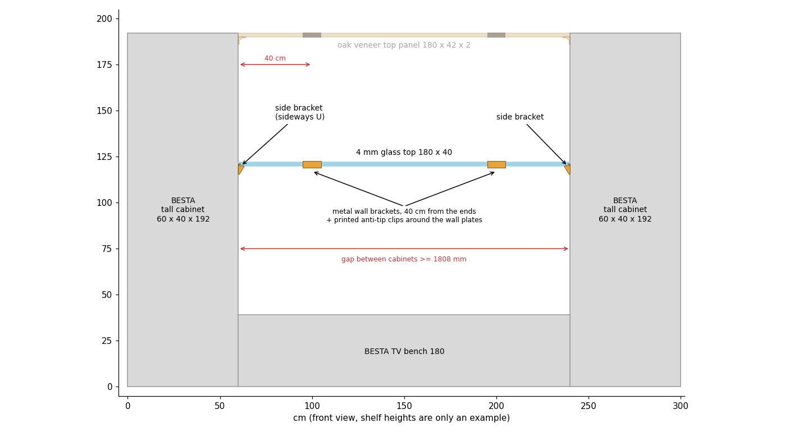
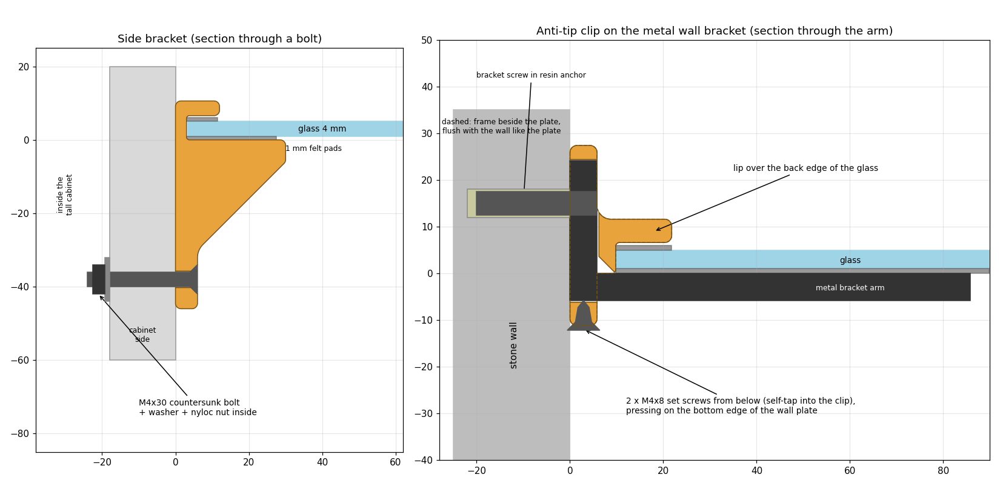
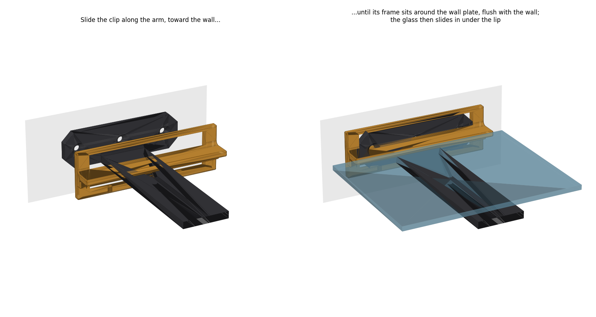
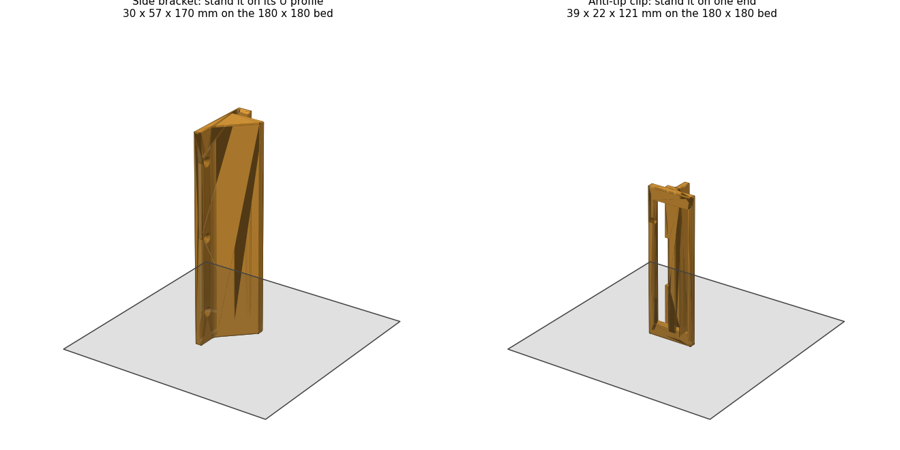

# BESTÅ Glass Shelf Support

Turns an IKEA **BESTÅ glass top panel (180 × 40 cm, 4 mm tempered glass)** into a floating shelf between two tall BESTÅ cabinets, above the BESTÅ TV bench. The glass is never drilled:

- **It rests on 2 metal wall brackets.** They are flat-bar T brackets with 25 cm arms, placed 40 cm from each end, so the shelf stands on the wall alone.
- **2 printed anti-tip clips hold its back edge.** Each is a frame that fits around a bracket's wall plate, flush with the wall and exactly as thick as the plate, with a lip over the back edge of the glass. A weight on the front edge (the arms are 25 cm, the glass is 40 cm deep) cannot tip the glass up.
- **2 printed side brackets (sideways U) can hold its ends.** They are optional extras, bolted to the cabinet sides. If you ever need to move a cabinet, unbolt the U and the shelf stays up.



## Parts

| File | Qty | What it is |
|---|---|---|
| `anti_tip_clip_x2.stl` | 2 | 121 mm frame that slides along the arm and around the wall plate of a metal bracket, flush with the wall, with a 5 mm lip over the back edge of the glass. It sticks out only ~22 mm from the wall: the metal bracket carries the glass, and the clip only stops the back edge from lifting. 2 M4 set screws from below lock it. |
| `side_bracket_x2.stl` | 2 | Sideways U, 170 mm long, bolted to the cabinet side; the glass end slides into it. It is symmetric, so for the other side just rotate it 180°. |
| `glass_shelf_supports.py` | – | Parametric FreeCAD script that generates everything. |
| `glass_shelf_supports.FCStd` | – | FreeCAD model. |





The FreeCAD model also contains a reference model of the metal bracket (`Ref_MetalBracket`) and a piece of glass (`Ref_Glass`), mounted around the clip. When run, the script checks that the clip never overlaps the bracket, both mounted and while sliding on. After changing the bracket measurements, check that its output still shows `overlap ... 0.000`.

## Hardware

| Qty | Item | Where |
|---|---|---|
| 2 | Flat-bar T shelf bracket, 25 cm arm (e.g. TESSTINA "concealed" 80 kg: wall plate 100 × 30 × 5.8 mm, 3 countersunk holes) | wall |
| 6 | Wall fixings for those brackets, see [Fixing into a thick stone wall](#fixing-into-a-thick-stone-wall) | bracket → wall |
| 4 | M4 × 8 screw (any head) | clip set screws (2 per clip), self-tap into the plastic |
| 6 | M4 × 30 countersunk bolt (ISO 10642 / DIN 7991) | side brackets → through the cabinet side |
| 6 | M4 washer, wide (DIN 9021) | inside the cabinet |
| 6 | M4 nyloc nut (DIN 985), or a plain nut with medium (blue) threadlocker | inside the cabinet |
| ~1 m | 1 mm adhesive felt tape, 10 mm wide | every face that touches the glass |

**Why bolt through the cabinet?** BESTÅ frame sides are particleboard skins with a honeycomb paper core, so wood screws in the middle of a side panel hold poorly. A bolt with a wide washer inside holds firmly. M4 × 30 suits sides up to ~19 mm thick; use M4 × 35 if yours are thicker.

## Before you start

1. **Glass thickness.** The IKEA spec is 0.4 cm. Measure it with a caliper and set `GLASS_T` if it differs.
2. **Metal brackets.** Measure the arm width and thickness (`BAR_W`, default 38, and `BAR_T`, default 5.8). Also measure the wall plate width and thickness (`PLATE_W`, default 100, and `PLATE_T`, default 5.8) and how far the plate rises above the top of the arm (`PLATE_UP`, default 24). Then regenerate the clip.
3. **Depth.** The back edge of the glass ends up about 10 mm from the wall: 5.8 mm of plate, plus 4 mm to clear the bend between plate and arm (`BEND_R`). Check that this works with how far your cabinets stand from the wall.
4. **Gap between the cabinets (side brackets only).** It must be at least **1808 mm**: 1800 of glass, plus 3 mm of U back wall on each side, plus 2 mm of play. If it is smaller, set `BACK = 0`: the U becomes an L and the glass rests on it with no top lip. Or leave the side brackets out.

## Printing (Bambu Lab A1 mini)

| Setting | Value |
|---|---|
| Material | PETG or ASA (not PLA: it creeps under constant load) |
| Layer height | 0.2 mm |
| Walls | 5 |
| Top/bottom layers | 5 |
| Infill | 40 % gyroid |
| Supports | none |
| Brim | yes for the side brackets (tall and narrow) |



- **Anti-tip clip:** stand it on one end (121 mm tall) and add a brim. The profile then grows straight up and the lip is strong. The only bridge is the short one over the plate opening.
- **Side bracket:** stand it upright on its U profile (170 mm tall). The layers then follow the profile, so the ledge carrying the glass does not load the layer lines in tension.

## Installation

1. **Metal brackets.** Mount the 2 metal brackets on the wall **40 cm from each end of the shelf**, i.e. 100 cm apart and centered on the gap. The tops of both arms must be at exactly the same height: use a spirit level on each one and a long straight edge across both. Shelf height = top of the arm + 1 mm of felt.
2. **Clips.** Slide a clip along each arm until its frame goes around the wall plate and touches the wall. Then tighten the 2 M4 × 8 set screws from below: they press on the bottom edge of the wall plate and pull the frame down onto its top edge. Snug is enough: they only need to stop the clip from sliding.
3. **Felt.** Stick felt tape on top of each arm and under each clip lip.
4. **Side brackets (optional).** Lay the straight edge on the two arms and mark that height on both cabinet sides. The top of each side-bracket ledge goes exactly there, so all four supports are level. Center each bracket on the depth with the U opening toward the gap.
   - **Drill:** use the bracket as a template and drill **4.5 mm** through the cabinet side at its 3 holes, with a scrap block clamped inside so the melamine doesn't chip.
   - **Bolt:** fit the countersunk bolts from the bracket side, and the washers and nuts inside the cabinet. Felt goes in the U too.
5. **Glass.** Hold it level and slide it in from the front, under the clip lips (and into the U slots), until its back edge touches the clips. It should not rattle. If it does, use thicker felt, and if it is too tight, thinner felt (or change `PAD`).

**Moving a cabinet later:** take the glass out, unbolt that side bracket, move the cabinet, then put everything back. The metal brackets and clips stay on the wall.

## Fixing into a thick stone wall

Old stone walls (often ~1 m thick: hard stones bedded in lime mortar, with voids, under a thick plaster coat) are hard on ordinary plugs. The drill wanders between hard stone and soft mortar, holes come out oversized, and the plug has nothing solid to expand against.

**Best option: injection resin (chemical anchor).** Fischer FIS V / FIS EM Plus, Würth WIT, Mungo and similar.
- **How:** drill, clean the hole thoroughly (blow out and brush, at least twice: dust is what makes resin fail), inject resin from the bottom up and push in the plug while the resin is wet. You can use the plug supplied with the bracket, or a threaded rod or internally threaded sleeve (e.g. Fischer RG MI). Wait the cure time printed on the cartridge (usually 1–2 h) before driving the screw and loading.
- **Voids:** if the hole hits a cavity, put a **mesh sleeve** in the hole first, so the resin doesn't vanish into it.

**Simpler option, if the hole comes out clean in solid stone:** a good universal plug such as Fischer DuoPower or UX, longer than usual (e.g. 8 × 65). It must go past the plaster, because the old plaster (2–3 cm) holds nothing and only the depth in the stone counts.

**Drilling tips:**
- **Tool:** use hammer mode (an SDS rotary hammer is ideal) with a sharp masonry bit.
- **Mortar:** if the bit slips into soft mortar, switch hammer off so the hole doesn't widen.
- **Oversized hole:** if a hole comes out too big, don't force a bigger plug in; use resin.

## How stiff is it?

Rough estimates of the sag of a 1.8 m shelf:

| Support | 4 mm glass |
|---|---|
| Only at the ends (side brackets alone) | ~36 mm |
| 2 brackets 30 cm from the ends | ~5 mm |
| **2 brackets 40 cm from the ends** | **< 1 mm** (≈ 2 mm with 10 kg spread on top) |

## Changing the design

All dimensions (glass, felt, metal bracket, clip, side bracket) and the fillet radii (`R_INNER`, `R_OUTER`, `R_SLOT`, `R_END`) are parameters at the top of `glass_shelf_supports.py`. Edit them and run:

```bash
/Applications/FreeCAD.app/Contents/Resources/bin/freecadcmd glass_shelf_supports.py
```

This regenerates the `.FCStd` model and both STL files in this folder.
