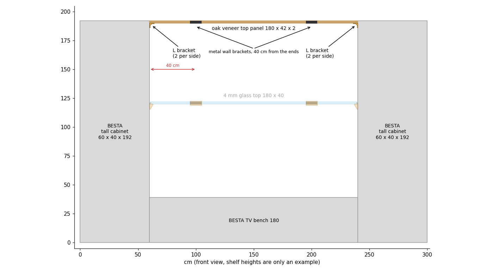
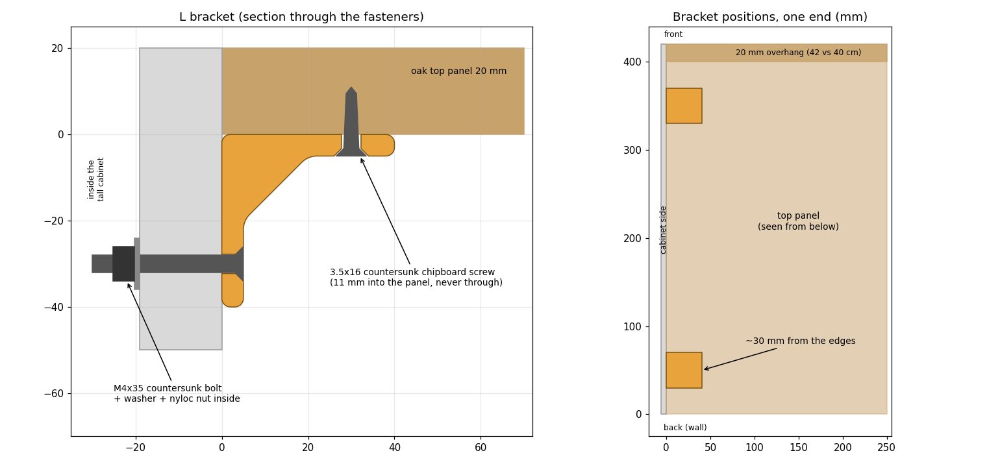
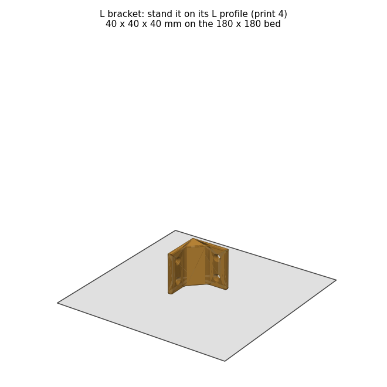

# BESTÅ Top Panel Brackets

Fixes an IKEA **BESTÅ oak veneer top panel (180 × 42 × 2 cm, solid particleboard)** between two tall BESTÅ cabinets, for example flush with their tops:

- **It is carried by 2 metal wall brackets.** They are flat-bar T brackets with 25 cm arms, 40 cm from each end, screwed up into the panel, so the panel stands on the wall alone.
- **4 small printed L brackets lock its ends** to the cabinet sides: one leg is bolted to the cabinet, the other is screwed up into the panel. Nothing is visible from the front, and nothing sits between the panel end and the cabinet. To move a cabinet later, unbolt its two L brackets and the panel stays up.



## Parts

| File | Qty | What it is |
|---|---|---|
| `l_bracket_x4.stl` | 4 | 40 × 40 × 40 mm L bracket with a 45° gusset and rounded edges, 2 per side (front and back). |
| `top_panel_brackets.py` | – | Parametric FreeCAD script that generates everything. |
| `top_panel_brackets.FCStd` | – | FreeCAD model. |



## Hardware

| Qty | Item | Where |
|---|---|---|
| 2 | Flat-bar T shelf bracket, 25 cm arm (e.g. TESSTINA "concealed" 80 kg) | wall |
| 6 | Wall fixings for those brackets, see [Fixing into a thick stone wall](../Besta%20Glass%20Shelf%20Support/README.md#fixing-into-a-thick-stone-wall) | metal bracket → wall |
| 4–6 | 3.5 × 16 countersunk chipboard screw | metal bracket arm → underside of the panel |
| 8 | M4 × 35 countersunk bolt (ISO 10642 / DIN 7991) | L brackets → through the cabinet side |
| 8 | M4 washer, wide (DIN 9021) | inside the cabinet |
| 8 | M4 nyloc nut (DIN 985), or a plain nut with medium (blue) threadlocker | inside the cabinet |
| 8 | 3.5 × 16 countersunk chipboard screw (e.g. Spax) | L brackets → underside of the panel |

- **Cabinet side:** BESTÅ frame sides have a honeycomb paper core, so bolt through them rather than using wood screws. The BESTÅ sides measure 18–19 mm, so use **M4 × 35**. Through a 5–6 mm printed plate, the side, a washer and a 5 mm tall nyloc nut, an M4 × 30 would be ~2 mm too short, while M4 × 35 leaves a few mm of thread past the nut.
- **Top panel:** it is solid particleboard. A 3.5 × 16 screw goes ~11 mm into the 20 mm panel through a printed bracket (5 mm), or ~11 mm through a metal arm (5 mm), so it never comes through the top. Don't use the long shelf screws supplied with the metal brackets: they would go through the panel.

## Printing (Bambu Lab A1 mini)

| Setting | Value |
|---|---|
| Material | PETG or ASA |
| Layer height | 0.2 mm |
| Walls | 5 |
| Infill | 40 % gyroid |
| Supports | none |



Stand each L bracket on its L profile (40 mm tall), so the layers follow the profile and the corner is as strong as possible. All 4 fit on one plate.

## Before you start

- **Width:** the panel is exactly 180 cm, so the gap between the tall cabinets must be at least 1800 mm. The L brackets take no extra width.
- **Depth:** the panel is 42 cm deep against 40 cm cabinets. Its back edge sits ~5 mm off the wall, in front of the metal wall plates, so it sticks out about 2.5 cm in front of cabinets that touch the wall.
- **Wall plates:** they are 25 mm tall, so they rise 20 mm above the 5 mm arm, exactly the thickness of the panel. They end flush with its top and stay hidden behind it.

## Installation

1. **Mark the height.** For a panel flush with the cabinet tops (192 cm), the top of the metal arms and of the L brackets sits **20 mm below the cabinet top**. A 20 mm offcut of wood makes a good spacer.
2. **Metal brackets.** Mount the 2 metal brackets on the wall **40 cm from each end of the gap** (100 cm apart), level with each other. Use a spirit level on each one and a long straight edge across both. See the stone wall notes for the fixings.
3. **L brackets.** Use 2 per side, about **30 mm from the front and back edges** (see the plan view above), at the same height as the arms. Lay the straight edge on the arms to transfer it.
4. **Drill the cabinet sides.** Use each L bracket as a template and drill **4.5 mm** through the cabinet side at its 2 holes. Clamp a scrap block inside so the melamine doesn't chip.
5. **Bolt the L brackets.** Fit the countersunk bolts from the bracket side, and the washers and nuts inside the cabinet.
6. **Lay the panel.** Rest the panel on the 2 arms and the 4 L brackets. Push it back against the wall plates and check that it is level and flush.
7. **Screw from below.** Drill **2.5 mm** pilot holes into the panel through the holes of the arms and the L brackets. Wrap tape on the bit at **13 mm** as a depth stop, so you never come out through the veneer. Then drive the 3.5 × 16 screws.

## How stiff is it?

Rough estimates of the sag of the 1.8 m panel:

| Support | 20 mm oak top panel |
|---|---|
| Only at the ends (L brackets alone) | ~11 mm, more over time |
| 2 brackets 30 cm from the ends | ~1.6 mm |
| **2 brackets 40 cm from the ends** | **< 0.5 mm**, even with 10 kg on top |

## Changing the design

All dimensions, including the fillet radii (`R_INNER`, `R_OUTER`, `R_END`), are parameters at the top of `top_panel_brackets.py`. Edit them and run:

```bash
/Applications/FreeCAD.app/Contents/Resources/bin/freecadcmd top_panel_brackets.py
```

This regenerates the `.FCStd` model and the STL file in this folder.

The script also prints the bolt length needed for the cabinet sides from `CABINET_SIDE` (measured: 18–19 mm, set to 19) and the washer and nut sizes. Rerun it if your sides differ.
